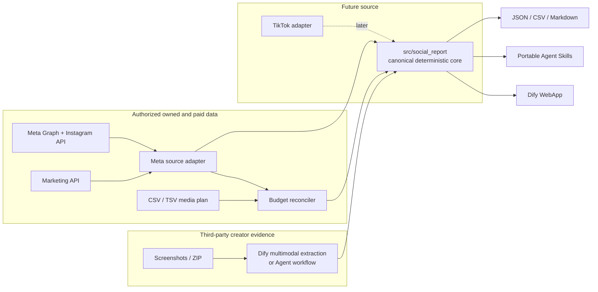

# Social Media Report Automation

<div align="center">

[](https://github.com/czoemeijer/social-media-report-automation/actions/workflows/ci.yml)
[](https://skills.sh)
[](https://www.python.org/)
[](LICENSE)

**Auditable social-media reporting for creator evidence, authorized owned accounts, and paid Meta
delivery—with deterministic math, explicit provenance, and no silent scope mixing.**

[Quickstart](#quickstart) · [Skills](#three-portable-agent-skills) ·
[Architecture](#architecture) · [Golden rules](#the-six-golden-audit-rules) ·
[Meta API](docs/META_API.md) · [Dify](docs/DIFY_DEPLOYMENT.md) ·
[Contributing](CONTRIBUTING.md)

</div>

---

## The problem

Social reports often combine evidence that does not mean the same thing: private creator Insight
screenshots, owned-account organic metrics, and paid delivery. Generative extraction can also turn
missing values into zero, confuse rounded UI tokens with exact values, recompute arithmetic
incorrectly, or add overlapping Reach and call it a unique audience.

This project separates perception from calculation. Vision models can reconstruct messy screenshot
evidence, and Meta APIs can read authorized assets, but one Python core validates scope, provenance,
identity, money, and formulas before anything becomes a report.

## What the suite solves

- Reconstructs Instagram/Facebook campaigns from direct images or safe ZIP uploads in Dify.
- Preserves exact, approximate, missing, and unreadable measurement semantics.
- Reads authorized Instagram Professional and Meta Ad Account data through a generic v26.0 adapter.
- Matches paid creatives to organic content using exact source IDs or normalized permalinks.
- Reconciles planned CSV/TSV media budgets against one non-duplicated Ads Insights level.
- Exports auditable JSON, spreadsheet-safe CSV, and deterministic Markdown.

## Three portable Agent Skills

| Skill | Use it for | Data source | Key output |
|---|---|---|---|
| [`social-report-audit`](skills/social-report-audit/) | Third-party creator Feed/Reel audits | Submitted screenshots or normalized evidence | Scope-aware engagement audit |
| [`story-series-extract`](skills/story-series-extract/) | Third-party creator Story sequences | Submitted Story screenshots | Deduplicated sequence and drop-off summary |
| [`owned-media-report`](skills/owned-media-report/) | Authorized first-party organic + paid reporting | Meta Graph, Instagram, Marketing API; optional budget | Owned-media report and plan/actual reconciliation |

An agency or brand token must not be assumed to expose a third-party creator's private Reach, Saves,
Story navigation, watch time, or other Insights. Those workflows remain evidence-first unless the
creator independently authorizes the application.

## Architecture



`src/social_report` is the single source of truth. Skills, the project-owned Dify plugin, workflow
DSL, and CLI are thin interfaces. There is no separate API service, queue, database, or OAuth portal.

## The six golden audit rules

| Rule | Enforcement |
|---|---|
| Missing is not zero | Absent or unsupported values stay `null`/unavailable; zero requires explicit evidence. |
| Incomplete engagement is a lower bound | Missing likes/comments/shares/saves disables complete ER and preserves a lower bound. |
| Scope never disappears | Organic, paid, mixed-or-unknown, and unknown remain separate. |
| Reach is non-additive | Content Reach is not presented as unique campaign Reach; organic + paid Reach is never summed as unique. |
| Platform totals stay distinct | Meta `total_interactions` is preserved separately from locally summed action components. |
| Identity must be deterministic | Paid↔Organic and budget matches use exact IDs or normalized permalinks; fuzzy titles require review. |

## Quickstart

Install the minimal project and run its complete local gate:

```bash
uv sync --extra dev
uv run python -m unittest discover -s tests -v
uv run ruff check src tests scripts evals plugins skills
uv run mypy
```

### Authorized Meta API

```bash
cp .env.example .env.local
chmod 600 .env.local
# Add your own authorized Meta token to .env.local; never commit it.

uv run social-report meta discover --json
uv run social-report meta doctor
uv run social-report meta pull --from 2026-01-01 --to 2026-01-31 \
  --budget path/to/media-plan.tsv --format json --output owned-report.json
```

With one compatible Page/Instagram/Ad Account relationship, selectors can resolve automatically.
Multiple candidates require explicit environment values or CLI flags. See the
[Meta API guide](docs/META_API.md) for User Token, long-lived User Token, System User Token,
`appsecret_proof`, capabilities, and operational security.

### Creator evidence Skills

```bash
python3 skills/social-report-audit/scripts/calculate_metrics.py examples/sample-input.json
python3 skills/story-series-extract/scripts/extract_story_series.py \
  examples/sample-story-series-input.json
```

### Dify WebApp

```bash
uv run python scripts/package_plugin.py
uv run python scripts/dify_deploy.py discover
```

The current workflow accepts direct images and safe ZIPs, performs global reconstruction before
per-asset extraction, applies a bounded confidence-driven second pass, and calls six deterministic
plugin tools. The committed DSL contains no model provider or secret binding. Follow the
[deployment guide](docs/DIFY_DEPLOYMENT.md) for signed plugin installation and live validation.

## Meta capabilities

- Environment-driven User Token and System User Token consumption.
- Optional official long-lived User Token exchange with explicit private save target.
- Optional `appsecret_proof` and token debug when app credentials are configured.
- `/me`, Page, linked Instagram Professional, and Ad Account discovery with ambiguity rejection.
- Instagram profile, cursor-paginated media, common Insights, and Reel watch time in milliseconds.
- Account/campaign/ad set/ad Insights, creatives, raw actions, and cost-per-action maps.
- Bounded GET retries, `Retry-After`, timeouts, structured errors, and paging URL redaction.
- Read-only doctor and sanitized live smoke test; CI never requires production credentials.

Facebook Page identity is required for discovery and creative identity. Facebook organic Post
Insights and owned Instagram Story ingestion are not claimed by this release; the existing Story
screenshot workflow remains intact.

## Verification

The full gate runs unit/regression tests on Linux and macOS with Python 3.9 and 3.12, Ruff, strict
mypy, generated-schema drift detection, Dify DSL validation, wheel/sdist builds, and an official
Dify CLI package/import smoke test. Live Meta verification is a separate local, read-only gate so
credentials and production payloads never enter GitHub Actions.

Current Dify evidence covers a signed 0.1.1 plugin on Dify 1.17.1 Community, all six provider tools,
direct-image and ZIP draft execution, bounded sequential extraction, and deterministic live/local
parity. Provider credit exhaustion is external and not treated as a product defect.

## Privacy and security

Raw screenshots, archives, reports, spreadsheets, `.env.local`, `*.secret`, keys, and build output
are ignored. Public tests and examples are synthetic. The Meta client never persists tokens or raw
credential-bearing paging URLs. Dify retention and the operator-selected model provider remain
deployment responsibilities. Read [Security](SECURITY.md) and [Privacy](docs/PRIVACY.md) before
processing confidential assets.

## Project layout

```text
src/social_report/                 canonical validation, metrics, reporting, budget logic
src/social_report/sources/meta/    read-only Meta auth, client, discovery, APIs, mapping
plugins/dify-social-report/        six thin deterministic Dify tools
deploy/dify/                       multimodal workflow DSL and prompts
skills/                            three portable Agent Skills
schemas/                           generated canonical JSON Schemas
scripts/                           packaging, deployment, validation, live smoke
evals/                             synthetic fixtures and deterministic scorer
tests/                             offline core, API-contract, security, and regression tests
```

Licensed under the [MIT License](LICENSE).
