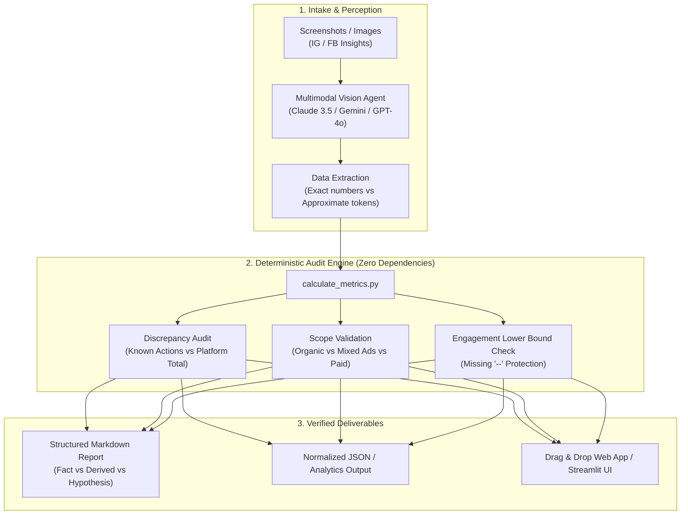

# Social Media Report & Audit Skill (`social-report-audit`)

<div align="center">

[](https://github.com/czoemeijer/social-media-report-automation/actions/workflows/ci.yml)
[](https://skills.sh)
[](LICENSE)
[](https://www.python.org)
[](skills/social-report-audit/scripts/calculate_metrics.py)
[](tests/)

**An open-source Agent Skills suite and deterministic calculation engine that audits social media campaign screenshots (Instagram & Facebook Insights), extracts Story sequence performance, prevents LLM arithmetic hallucinations, and produces executive-ready reports.**

[Quickstart](#quickstart) •
[Skills Overview](#skills-in-this-suite) •
[Core Audit Rules](#the-four-golden-audit-rules) •
[Drag & Drop UI](#drag--drop-ui-for-non-technical-users) •
[SOP Workflow](docs/SOP.md) •
[Contributing](CONTRIBUTING.md)

</div>

---

## The Problem: Why LLM Math Fails in Campaign Reporting

Social media reporting across influencer agencies, brands, and creators regularly suffers from four major flaws when processed by generative AI:

1. **Arithmetic Hallucination & Unit Misinterpretations:** LLMs routinely confuse rounded UI tokens (e.g. converting `1.1k` to `1,100` when exact records show `1,225`, or mis-summing four engagement actions like the classic 2,071 vs 2,107 bug).
2. **Conflating Platform Interactions with Direct Reactions:** Blindly trusting Meta's composite "Interactions" card (which contains profile visits, sticker taps, and bio link clicks) and reporting it as post reactions (Likes + Comments + Shares + Saves).
3. **Flawed Reach Aggregation:** Arithmetically adding post Reach across different creators or dates and falsely presenting it as "Unique Campaign Reach".
4. **Organic vs. Paid Media Blurring:** Silently blending paid ad delivery into organic creator benchmarks when Meta displays its combined ads notice.

## What This Suite Solves

This repository couples multimodal visual extraction with **zero-dependency, deterministic Python engines**. It enforces mathematical rigor, strict provenance tracking, and factual accountability.

---

## Skills in this Suite

| Skill | Folder | Purpose | Key Output |
|---|---|---|---|
| **`social-report-audit`** | [`skills/social-report-audit/`](skills/social-report-audit/) | In-depth audit of Feed & Reel posts, discrepancy detection between platform interactions and reactions, lower-bound ER for incomplete data, organic vs. paid validation. | Complete executive audit Markdown report with verified formulas and discrepancy warnings. |
| **`story-series-extract`** | [`skills/story-series-extract/`](skills/story-series-extract/) | Fast, direct extraction of Instagram/Facebook Story sequences for campaign & creator activations. No complex math—strictly extracts series totals, drop-off rate, and interactive poll/quiz outcomes. | Standardized series performance block (`Souhrnný výkon série`). |

---

## System Architecture



---

## The Four Golden Audit Rules

| Rule | Principle | Enforcement Mechanism |
| :--- | :--- | :--- |
| **1. Incomplete Engagement Protection** | If any component of $\text{Likes} + \text{Comments} + \text{Shares} + \text{Saves}$ is missing or `--`, **complete ER MUST NOT be reported.** | Script sets `calculated_er_by_reach = None` and outputs an auditable **Minimum Lower Bound** (`er_lower_bound_by_reach`). |
| **2. Ads Disclaimer Scope Classification** | If Insights states *"Insights include data from your post/reel and any ads"* without a separate Ad tab breakdown: | Scope is strictly classified as `mixed_or_unknown` with mandatory notice that organic and paid contributions cannot be separated. |
| **3. Absence is NOT Zero** | If a platform card omits a metric (e.g. Profile Activity card showing Follows but not External Link Taps): | Metric remains `null / unavailable`, never coerced to `0`. Zero requires explicit UI evidence (`Business address taps: 0`). |
| **4. Feed vs. Insights Separation** | Feed-visible share/send (paper plane) and repost (arrows) counts: | Preserved in separate fields (`feed_shares`, `feed_reposts`) without overwriting canonical Insights shares. |

For detailed mathematical formulas and schemas, consult:
- [Metric Reference Guide](skills/social-report-audit/references/METRICS.md)
- [Data Model & Source-of-Truth Hierarchy](skills/social-report-audit/references/DATA_MODEL.md)
- [Standard Report Templates](skills/social-report-audit/references/REPORT_FORMAT.md)
- [Standard Operating Procedure (SOP)](docs/SOP.md)

---

## Quickstart

### 1. Install as an Agent Skill (Recommended)

Install globally or into your workspace using the standard `skills` CLI:

```bash
# Install globally for all supported agents (Antigravity, Claude Code, Cursor, Codex)
npx -y skills add czoemeijer/social-media-report-automation --skill social-report-audit -g -y
npx -y skills add czoemeijer/social-media-report-automation --skill story-series-extract -g -y

# Or install locally in current project:
npx -y skills add czoemeijer/social-media-report-automation --skill social-report-audit -y
npx -y skills add czoemeijer/social-media-report-automation --skill story-series-extract -y
```

### 2. Manual CLI Execution

Both calculation engines are self-contained with **zero third-party dependencies** (Python 3.9+ standard library only):

```bash
# 1. Run Social Report Audit (Feed / Reel Posts)
python3 skills/social-report-audit/scripts/calculate_metrics.py examples/sample-input.json

# 2. Run Story Series Extract (Campaign Story Sequences)
python3 skills/story-series-extract/scripts/extract_story_series.py examples/sample-story-series-input.json
```

See [examples/sample-report.md](examples/sample-report.md) and [examples/sample-story-series-report.md](examples/sample-story-series-report.md) for generated sample outputs.

---

## Drag & Drop UI for Non-Technical Users

For account managers, coordinators, or teammates who prefer a visual drag-and-drop workflow:

```bash
# 1. Install optional lightweight UI dependencies
pip install streamlit pillow

# 2. Launch the studio
streamlit run ui/streamlit_app.py
```

* **Drag & Drop Upload:** Drop multiple screenshot files into the browser.
* **Instant KPI Cards:** Shows Views, Non-Unique Summed Reach, Known Actions, and Weighted ER Lower Bound.
* **One-Click Export:** Download client-ready Markdown audit reports.

For enterprise teams deploying on **Dify**, review the [Client & UI Solutions Architecture Guide](docs/CLIENT_SOLUTIONS.md).

---

## Privacy & Security Model

This project is built for zero data leakage when working with confidential brand assets:

1. **Strict Git Exclusions:** `.gitignore` blocks screenshots (`*.png`, `*.jpg`, `*.jpeg`), media files, archives, secrets, and private reports.
2. **Synthetic Public Fixtures:** All repository tests and examples use strictly synthetic data.
3. **Local Deterministic Execution:** The core calculation script performs no external telemetry or tracking.

---

## Testing & Verification

Run the comprehensive unit and regression test suite:

```bash
python3 -m unittest discover tests -v
```

All 20 unit and regression tests pass deterministically across:
* **Regression Case 1 (FB Reel):** $398 + 28 + 2 + 9 = 437 \rightarrow 437 / 11,500 \approx 3.80\%$ (approximate flag preserved).
* **Regression Case 2 (IG Reel):** $1,225 + 64 + 3 + 39 = 1,331 \rightarrow 1,331 / 17,664 \approx 7.53\%$ (prevents rounding to 1,100).
* **Regression Case 3 (IG Reel):** $130 + 6 + 3 + 111 = 250 \rightarrow 250 / 7,563 \approx 3.31\%$ (recipe save rate verified).
* **Regression Case 4 (IG Reel):** $123 + 2 + 2 + 49 = 176 \rightarrow 176 / 6,402 \approx 2.75\%$.
* **Regression Case 5 (Interaction Bug Fix):** Asserts $1,753 + 100 + 10 + 208 = 2,071$ (never 2,107 without uncategorized actions cataloged).
* **Post-Audit Cases (6–18):** Incomplete ER lower bound enforcement, ads disclaimer scope isolation, absence vs. zero preservation, and feed-visible share conflict resolution.
* **Story Series Cases (19–20):** Sequence views aggregation, starting reach isolation, drop-off rate computation, and interactive poll/quiz extraction.

---

## Project Structure

```
social-media-report-automation/
├── README.md                                  # Project overview and instructions
├── LICENSE                                    # MIT License
├── CONTRIBUTING.md                            # Contribution guidelines
├── CHANGELOG.md                               # Version release notes
├── package.json                               # Package and skills CLI metadata
├── .gitignore                                 # Protection against data leakage
├── .github/
│   ├── workflows/ci.yml                       # GitHub Actions CI (Linux/macOS, Python 3.9-3.12)
│   ├── ISSUE_TEMPLATE/                        # Bug report and feature request templates
│   └── PULL_REQUEST_TEMPLATE.md               # Standardized PR checklist
├── skills/
│   ├── social-report-audit/                   # Skill 1: Feed & Reel deep post audit
│   │   ├── SKILL.md                           # Main agent instruction definition
│   │   ├── references/
│   │   │   ├── METRICS.md                     # Formulas, scopes, and aggregation rules
│   │   │   ├── DATA_MODEL.md                  # Provenance hierarchy and schema
│   │   │   └── REPORT_FORMAT.md               # Markdown report templates
│   │   └── scripts/
│   │       └── calculate_metrics.py           # Python deterministic calculation engine
│   └── story-series-extract/                  # Skill 2: Story series performance extractor
│       ├── SKILL.md                           # Story series agent instruction definition
│       ├── references/
│       │   └── TEMPLATE.md                    # Standardized series output templates
│       └── scripts/
│           └── extract_story_series.py        # Python story series parser & formatter
├── docs/
│   ├── SOP.md                                 # Standard Operating Procedure for audit teams
│   └── CLIENT_SOLUTIONS.md                    # Dify & Streamlit UI architectural guide
├── ui/
│   └── streamlit_app.py                       # Drag-and-drop web/desktop client
├── examples/
│   ├── README.md                              # Guide to synthetic test cases
│   ├── sample-raw-input.md                    # Raw simulation input
│   ├── sample-input.json                      # Normalized test fixture
│   ├── sample-report.md                       # Sample Markdown audit report
│   ├── sample-story-series-input.json         # Story series sample fixture
│   └── sample-story-series-report.md          # Sample Story series performance report
└── tests/
    ├── test_regression_cases.py               # 15 regression test cases
    ├── test_calculate_metrics.py              # 3 CLI and edge-case unit tests
    └── test_story_series_extract.py           # 2 Story series extraction tests
```

---

## License

This project is licensed under the [MIT License](LICENSE).
