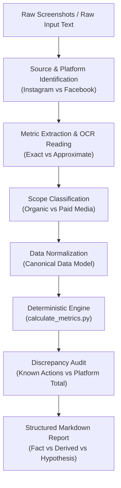

# Social Report Audit

[](https://agentskills.io)
[](https://opensource.org/licenses/MIT)
[](tests/)

An Agent Skill that extracts social-media metrics from Instagram and Facebook Insights screenshots or manually supplied numbers, normalizes them, audits inconsistencies, calculates derived engagement metrics, and generates structured, auditable campaign reports.

---

## The Problem

Social media reporting across influencer campaigns, agencies, and brand accounts is plagued by four recurring issues:

1. **Transcription & Unit Errors:** Misinterpreting rounded UI counts (e.g., treating `1.1k` as exact `1,100` when exact records show `1,225`).
2. **Ambiguous Engagement Formulas:** Inconsistently mixing platform-reported "Interactions" (which may include profile visits, link taps, and sticker replies) with direct post reactions (Likes, Comments, Shares, Saves).
3. **Flawed Reach Aggregation:** Arithmetically summing post Reach across multiple creators and mislabeling it as "unique campaign audience."
4. **Mixing Organic and Paid Media:** Merging paid ad impressions, spend, or boosted reach into organic creator benchmarks.

## What This Skill Solves

`social-report-audit` provides a standardized, auditable methodology for AI agents:

- **Source-of-Truth Hierarchy:** Raw screenshots and native exports always outrank generated reports.
- **Deterministic Math:** Uses strict formulas for Known Engagement Actions ($\text{Likes} + \text{Comments} + \text{Shares} + \text{Saves}$) and Calculated ER by Reach.
- **Interaction Discrepancy Auditing:** Decomposes composite platform interaction counts and reports uncategorized actions explicitly.
- **Strict Domain Boundaries:** Segregates organic creator metrics from paid media numbers.
- **Reach Overlap Disclosure:** Automatically tags summed Reach with audience overlap disclosures.
- **Reproducible Pipeline:** Pairs LLM visual extraction with a zero-dependency Python calculation script.

---

## Workflow Architecture



---

## Metric Definitions & Formulas

| Metric | Type | Standard Formula / Definition | Caveats |
| :--- | :--- | :--- | :--- |
| **Known Engagement Actions** | Deterministic Sum | $\text{Likes} + \text{Comments} + \text{Shares} + \text{Saves}$ | Base for auditable organic engagement. |
| **Calculated ER by Reach** | Calculated Ratio | $\frac{\text{Known Engagement Actions}}{\text{Reach}} \times 100$ | Primary standard ER. Approximate if Reach is approximate. |
| **Save Rate** | Calculated Ratio | $\frac{\text{Saves}}{\text{Reach}} \times 100$ | Measures recipe, tutorial, or reference bookmarking value. |
| **Comment / Like Ratio** | Calculated Ratio | $\frac{\text{Comments}}{\text{Likes}} \times 100$ | Measures conversation depth. Undefined (`N/A`) if Likes = 0. |
| **Sum of Content Reach** | Aggregation | $\sum \text{Reach}_{\text{post}}$ | **Contains audience overlap.** Not unique campaign reach. |

For exhaustive edge cases and schema rules, see:
- [Metric Reference Guide](skills/social-report-audit/references/METRICS.md)
- [Data Model & Source-of-Truth Hierarchy](skills/social-report-audit/references/DATA_MODEL.md)
- [Standard Report Templates](skills/social-report-audit/references/REPORT_FORMAT.md)

---

## Quick Demo

### 1. Raw Input
```text
Platform: Instagram
Format: Reel
Reach: cca 10,000 (approximate)
Likes: 420
Comments: 18
Shares: 32
Saves: 80
Platform-Reported Interactions: 550
```

### 2. Deterministic Audit
- **Known Engagement Actions:** $420 + 18 + 32 + 80 = 550$
- **Calculated ER by Reach:** $\frac{550}{10,000} \times 100 \approx 5.50\%$ (flagged approximate)
- **Save Rate:** $\frac{80}{10,000} \times 100 \approx 0.80\%$
- **Discrepancy Check:** Platform interactions ($550$) equal known actions ($550$). Uncategorized = $0$.

### 3. Generate Report
Run the calculation engine against structured input:
```bash
python3 skills/social-report-audit/scripts/calculate_metrics.py examples/sample-input.json
```
See [examples/sample-report.md](examples/sample-report.md) for the complete generated output.

---

## Installation

### For Google Antigravity
Clone or copy this repository into your workspace:
```bash
# Workspace project skill location:
mkdir -p .agents/skills
cp -r skills/social-report-audit .agents/skills/
```

### For Common Agent Skills Specification
Place the skill into your agent's configured skills path:
```bash
cp -r skills/social-report-audit <agent-skills-directory>/
```
Conforms directly to the [Agent Skills Open Specification](https://agentskills.io/specification).

---

## Privacy & Data Safety Model

This project is engineered for zero data leakage:

1. **No External Telemetry:** All extraction and calculation processes run locally within the agent execution environment.
2. **Strict Git Exclusions:** `.gitignore` blocks screenshots (`*.png`, `*.jpg`, `*.jpeg`), archive packages (`*.zip`), raw test dumps (`vzor dat/`, `.vzor_dat/`), and private reports (`REPORT_*.md`).
3. **Synthetic Public Examples:** All repository examples (`examples/`) use fictional names, synthetic values, and simulated scenarios.

---

## Project Structure

```
social-media-report-automation/
├── README.md                                  # Landing page and usage guide
├── LICENSE                                    # MIT License
├── .gitignore                                 # Protection against data leakage
├── skills/
│   └── social-report-audit/
│       ├── SKILL.md                           # Main agent instruction definition
│       ├── references/
│       │   ├── METRICS.md                     # Formulas, scopes, and aggregation rules
│       │   ├── DATA_MODEL.md                  # Provenance hierarchy and JSON schema
│       │   └── REPORT_FORMAT.md               # Standard Markdown report templates
│       └── scripts/
│           └── calculate_metrics.py           # Python deterministic calculation engine
├── examples/
│   ├── README.md                              # Guide to synthetic test cases
│   ├── sample-raw-input.md                    # Raw simulation input
│   ├── sample-input.json                      # Normalized test fixture
│   └── sample-report.md                       # Sample Markdown output
└── tests/
    ├── test_regression_cases.py               # Known regression tests (Cases 1–5)
    └── test_calculate_metrics.py              # CLI and edge-case unit tests
```

---

## Verification & Testing

Run the test suite using Python's standard library:

```bash
python3 -m unittest discover tests
```

All 13 unit and regression tests pass deterministically across:
- **Case 1 (FB Reel):** $398 + 28 + 2 + 9 = 437 \rightarrow 437 / 11,500 \approx 3.80\%$ (approximate flag preserved).
- **Case 2 (IG Reel):** $1,225 + 64 + 3 + 39 = 1,331 \rightarrow 1,331 / 17,664 \approx 7.53\%$ (prevents rounding to 1,100).
- **Case 3 (IG Reel):** $130 + 6 + 3 + 111 = 250 \rightarrow 250 / 7,563 \approx 3.31\%$.
- **Case 4 (IG Reel):** $123 + 2 + 2 + 49 = 176 \rightarrow 176 / 6,402 \approx 2.75\%$.
- **Case 5 (Interaction Bug Fix):** Asserts $1,753 + 100 + 10 + 208 = 2,071$ (never 2,107 unless additional actions are explicitly cataloged).
- **Edge cases:** Missing Reach, zero Likes, paid media boundaries, Reach aggregation warnings.

---

## Limitations

- **Cross-Asset Deduplication:** Without native Meta Ads Manager or API-level audience exports, cross-post and multi-creator audience deduplication cannot be calculated mathematically; summed Reach must always be labeled with an audience overlap caveat.
- **Cropped UI Captures:** If a metric is truncated or hidden behind a menu, the skill marks it unreadable rather than inferring values.
- **Platform Taxonomy Changes:** Social platforms periodically revise metric naming (e.g., "Accounts Center Accounts" vs. "Accounts reached"); new UI patterns must be mapped into `DATA_MODEL.md`.

---

## License

This project is licensed under the [MIT License](LICENSE).
