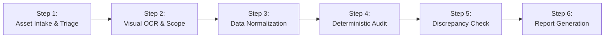

# Standard Operating Procedure (SOP): Social Media Campaign Audit

**Document Version:** 1.1.0  
**Target Roles:** Media Analysts, Campaign Managers, AI Agents, Quality Assurance Leads  
**Purpose:** Ensure 100% mathematical accuracy, data provenance, and auditable reporting across influencer and social media brand campaigns (Instagram, Facebook).

---

## 1. Overview & Operational Principles



### Core Tenets:
1. **Evidence First (Tier 1 Authority):** Original screenshots and platform CSV exports outrank any generated summaries or agency slide decks.
2. **Never Guess or Round:** Exact counts must never be rounded (e.g. `1,225` must never be recorded as `1,100`).
3. **Absence is NOT Zero:** An unlisted metric on a screenshot card is `unavailable / not shown`, never `0`.
4. **Deterministic Math:** Engagement calculations are performed by Python scripts (`calculate_metrics.py`), never generated by free-form LLM calculation.

---

## 2. Step-by-Step Execution Workflow

### Step 1: Asset Intake & Screenshot Verification
- [ ] Confirm file integrity and legibility.
- [ ] Group screenshots by post ID, thumbnail, or publication timestamp to avoid double-counting multi-tab captures (*Overview*, *Interactions*, *Audience*).
- [ ] Check whether both Organic (`Post`/`Reel`) and Paid (`Ad`) tabs are visible.

### Step 2: Extraction & OCR Safeguards
- [ ] **Exact Figures:** Extract verbatim (e.g. `4,639` $\rightarrow$ `4639`).
- [ ] **Approximate Figures:** Identify abbreviation tokens (`cca`, `~`, `k`, `tis.`). Mark `reach_is_approximate: true`.
- [ ] **Unreadable / Missing Fields:** If truncated or displayed as `--`, assign `null`. Do **not** substitute `0`.
- [ ] **Feed vs. Insights Shares:**
  - If public feed displays send/share icon (e.g. 7) and repost icon (e.g. 1), record them in `feed_shares` and `feed_reposts`.
  - Canonical `shares` from Insights remains `null` if shown as `--`. Never overwrite one with the other.

### Step 3: Scope Classification
- [ ] **Organic:** Standard creator posts with no ads disclaimer and no paid boost.
- [ ] **Paid:** Ad accounts, paid impressions, CPM, CPC, media spend.
- [ ] **Mixed or Unknown:**
  - If the screenshot shows: *„Insights include data from your post/reel and any ads“* and no separate `Ad` tab breakdown is provided:
  - Classify `scope: "mixed_or_unknown"`.
  - Mandatory report statement: *"Organic and paid contributions cannot be separated without a separate Ad breakdown."*

### Step 4: Deterministic Audit Execution
Prepare structured JSON and run the audited engine:
```bash
python3 skills/social-report-audit/scripts/calculate_metrics.py input.json
```

**Formulas Enforced:**
1. **Known Engagement Actions:**
   $$\text{Known Actions} = \text{Likes} + \text{Comments} + \text{Shares} + \text{Saves}$$
2. **Engagement Rate by Reach:**
   $$\text{Calculated ER by Reach} = \frac{\text{Known Actions}}{\text{Reach}} \times 100$$
   *Incomplete Data Exception:* If any of Likes, Comments, Shares, Saves is `null`, `calculated_er_by_reach` is set to `None` and reported strictly as a **Minimum Lower Bound** (`er_lower_bound_by_reach`).
3. **Save Rate:** $\frac{\text{Saves}}{\text{Reach}} \times 100$
4. **Comment-to-Like Ratio:** $\frac{\text{Comments}}{\text{Likes}} \times 100$ (N/A if Likes = 0).

### Step 5: Discrepancy Auditing
- [ ] If Meta reports composite "Interactions" exceeding Known Actions:
  $$\text{Uncategorized Actions} = \text{Platform Total} - \text{Known Actions}$$
  Categorize the delta as profile taps, sticker interactions, or link clicks.
- [ ] **Zero Comments Factuality:** If `Comments = 0`, state strictly the observed count. Never infer that comments were disabled or that audience behavior was passive.
- [ ] **No Speculative Causality:** Never hypothesize technical causes (API lag, caching, sync bugs) for missing values unless substantiated by platform error logs.

### Step 6: Final Report Assembly & Release
Assemble final Markdown according to `references/REPORT_FORMAT.md`:
- [ ] Include executive summary and campaign-level aggregation table.
- [ ] Add mandatory reach aggregation warning:
  > *„Sum of content-level Reach contains audience overlap and must not be interpreted as unique campaign Reach.“*
- [ ] Clearly demarcate FACT, DERIVED METRIC, INTERPRETATION, and RECOMMENDATION.
- [ ] Review by QA Lead before distribution to clients or stakeholders.
